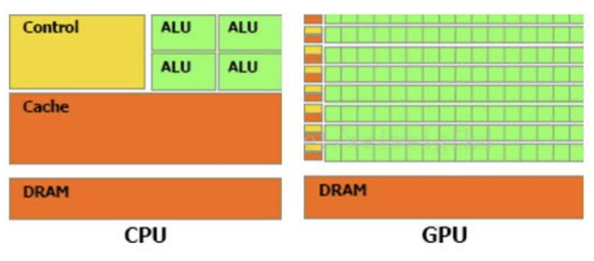
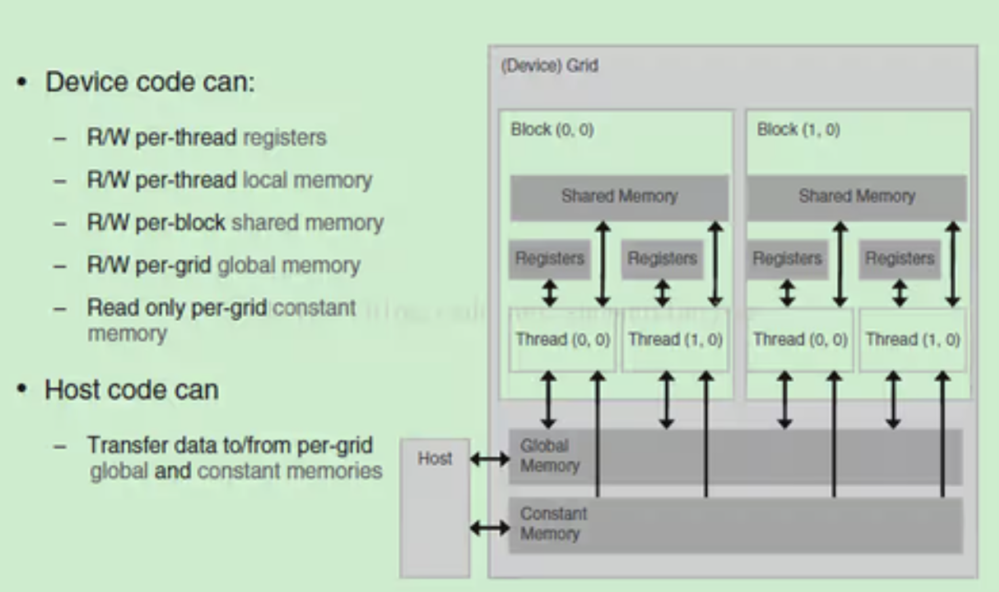
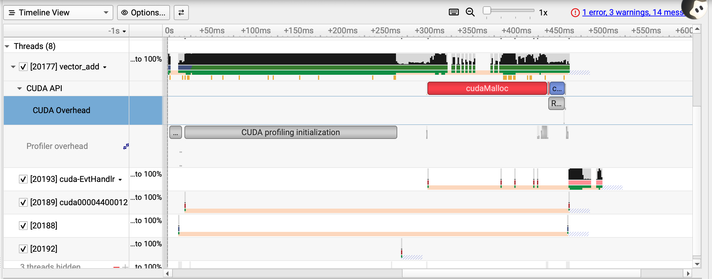
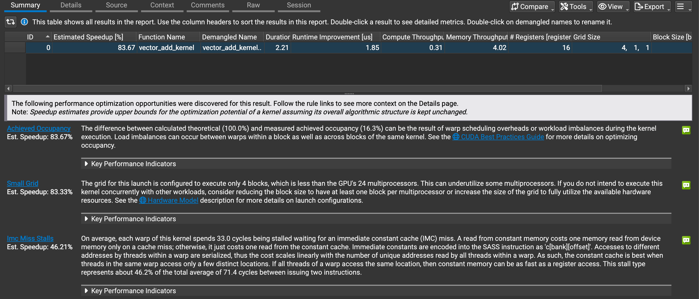

[TOC]

<div style="page-break-after: always;"></div>

#### GPU硬件与分布式基础

##### 结构基础

- GPU硬件架构中最核心的组件是图形处理核心（CUDA core），一个GPU通常包含数百到数千个CUDA core，并拥（Multiprocessors）以支持高度并行计算。每个CUDA core能够系列指令，实现高效并行计算。

- 在GPU出现之前，CPU一直负责着计算机中主要的运算工作，包括多媒体的处理工作。CPU的架构是有利于X86指令集的串行架构，CPU从设计思路上适合尽可能快的完成一个任务。

  - 但是如此设计的CPU的缺陷也显而易见：多媒体计算通常要求较高的运算密度、多并发线程和频繁地存储器访问，而由于X86平台中CISC（Complex Instruction Set Computer）架构中暂存器数量有限，CPU并不适合处理这种类型的工作。

  - 对于GPU来说，它的任务是在屏幕上合成显示数百万个像素的图像，也就是同时拥有几百万个任务需要并行处理，因此GPU被设计成可并行处理很多任务，而不是像CPU那样完成单任务。

- 因此CPU和GPU架构差异很大，CPU功能模块很多，能适应复杂运算环境；GPU构成则相对简单，目前流处理器和显存控制器占据了绝大部分晶体管。

  - CPU中大部分晶体管主要用于构建控制电路（比如分支预测等）和Cache，只有少部分的晶体管来完成实际的运算工作。而GPU的控制相对简单，且对Cache的需求小，所以大部分晶体管可以组成各类专用电路、多条流水线，使得GPU的计算速度有了突破性的飞跃，拥有了更强大的处理浮点运算的能力。 



- 为充分利用GPU的计算能力，NVIDIA在2006年推出了CUDA（ComputeUnifiedDevice Architecture，统一计算设备架构）这一编程模型。CUDA是一种由NVIDIA推出的通用并行计算架构，该架构使GPU能够解决复杂的计算问题。它包含了CUDA指令集架构（ISA）以及GPU内部的并行计算引擎。开发人员现在可以使用C语言来为CUDA架构编写程序。

##### 显存技术

- 显存（Graphics Memory）是GPU中重要的组成部分，用于存储图像、计算结果、模型参数等数据。主流的显存技术有GDDR（Graphics Double Data Rate）和HBM（High Bandwidth Memory）。GDDR具有较大的容量和较低的成本，适用于大规模图形处理；而HBM则具有更高的带宽和更低的功耗，适用于高性能计算和深度学习等任务。
- 共享内存



- GPU中每个线程对应一个register,而且对程序员不可见，**每个block对应一个share memry**，这个由程序操作，每个网格对应一个global memory，也就是说，所有线程使用同一个global memroy

- Shared Memory的核心价值在于减少全局内存访问次数和加速块内线程协作。

  - 全局内存（Global Memory）访问延迟约为数百个时钟周期，而 Shared Memory 仅需数十个时钟周期。当多个线程需要反复读取同一份全局内存数据时，将数据一次性加载到 Shared Memory 中供块内线程复用，能大幅降低全局内存访问次数，是性能提升的核心手段。 
  - 不同于全局内存的跨块共享特性，Shared Memory 是线程块级别的 “私有高速 缓存 ”，块内线程可通过它快速交换中间计算结果，无需通过全局内存中转，降低通信延迟。

  - 全局内存的访问效率高度依赖 “合并访问”（Coalesced Access），而 Shared Memory 可作为 “中转层”，将非合并的全局内存访问转换为合并访问，再在 Shared Memory 内重组数据供线程使用。
    - 以矩阵转置为例：如果我们按照行读取然后给每个县城分配转置任务就是按列来写，这样因为行是连续存储的，会直接受到硬件优化，所以很快；但列之间的地址是跳跃的，所以速度很慢。于是我们引入共享内存，先按行读取内容到共享内存里，在共享内存里操作成列主元，再分配任务，这样就会很快。

- 共享内存使用方法：

```cpp
__global__ void kernelFunction(float *input, float *output) {
    __shared__ float sharedData[256]; // 声明一个大小为 256 的共享内存数组
    int tid = threadIdx.x;
    // 从全局内存加载数据到共享内存
    sharedData[tid] = input[tid];
    __syncthreads(); // 确保所有线程都完成了加载
    // 进行一些计算
    sharedData[tid] = sharedData[tid] * 2.0f;
    __syncthreads(); // 确保所有线程都完成了计算
    // 将结果写回全局内存
    output[tid] = sharedData[tid];
}
```

- Shared Memory 优化：
  - Shared Memory 是由多个 Memory Bank 组成的，如果多个线程同时访问同一个 Memory Bank，则会发生 “Bank Conflict”（存储体冲突），导致访问速度降低。尽量设计内存访问模式，使得线程访问不同的存储体，来避免冲突。
  - 动态共享内存（extern **shared**）的核心优势是灵活适配不同 Tile 大小 / 数据类型，避免静态声明的内存浪费。

```cpp
__global__ void multiTypeSharedKernel(float *input, int *output, int n) {
    // 声明动态共享内存（无类型）
    extern __shared__ char sharedBuffer[];
    // 拆分缓冲区为不同类型的共享内存
    float *sharedFloat = (float*)sharedBuffer;
    int *sharedInt = (int*)(sharedFloat + 256); // 偏移 256 个 float 大小

    // 使用不同类型的共享内存
    sharedFloat[threadIdx.x] = input[threadIdx.x];
    sharedInt[threadIdx.x] = (int)sharedFloat[threadIdx.x];
    __syncthreads();

    output[threadIdx.x] = sharedInt[threadIdx.x];
}

// 调用时指定总大小：256*float + 256*int
kernel<<<1, 256, 256*sizeof(float) + 256*sizeof(int)>>>(input, output, n);

// ==============================================================================

// 运行时获取设备的 Shared Memory 每块最大容量
int maxSharedMemPerBlock;
cudaDeviceGetAttribute(&maxSharedMemPerBlock, cudaDevAttrMaxSharedMemoryPerBlock, 0);

// 计算最大可使用的 Tile 大小（以 float 为例）
int maxTileSize = sqrt(maxSharedMemPerBlock / sizeof(float));
// 向下取整为 16 的倍数（符合 CUDA 线程块最佳实践）
maxTileSize = (maxTileSize / 16) * 16;

// 调用核函数时动态指定共享内存大小
dim3 threads(maxTileSize, maxTileSize);
size_t sharedMemSize = maxTileSize * maxTileSize * sizeof(float);
matrixMultiplyWithShared<<<numBlocks, threads, sharedMemSize>>>(d_A, d_B, d_C, N);
```


##### 评价指标

- 算力是衡量GPU性能的关键指标之一，表示每秒执行的浮点运算次数。常用的衡量单位是FLOPS。

- 计算能力（吞吐量）：通常关心的是32位浮点计算能力。16位浮点训练也开始流行，如果只做预测的话也可以用8位整数。

- 显存大小：当模型越大，或者训练时的批量越大时，所需要的GPU内存就越多。

- 显存位宽：位数越大则瞬间所能传输的数据量越大

- 显存带宽：只有当内存带宽足够时才能充分发挥计算能力。

<div style="page-break-after: always;"></div>

#### CUDA开发基础

##### cu文件基本格式

- 头文件：
  - **标准 C/C++ 头文件**：如 `<stdio.h>`, `<stdlib.h>`。
  - **CUDA 运行时头文件**：`#include <cuda_runtime.h>`，提供 GPU 内存管理、数据传输等 API 声明。
  - **CUDA 工具包头文件**：如 `#include <cuda.h>`（较低层 API）或特定库的头文件（如 cuBLAS、cuSPARSE）。

- 核函数：在GPU上执行的函数，使用特殊调用语法 `kernel<<<grid_dim, block_dim>>>()` 启动。

```cpp
__global__ void vector_add_kernel(const float* A, const float* B, float* C, int N) {
    int idx = blockDim.x * blockIdx.x + threadIdx.x;
    if (idx < N) {
        C[idx] = A[idx] + B[idx];
    }
}
```

- 设备端函数：`__device__` 函数只能在 GPU 线程内部被调用，用于封装那些被多个线程反复使用的、相对独立的计算子过程。

```cpp
__device__ float complexMul(float a, float b) { return a * b; }
```

- 主机端函数：在 CPU 上执行的普通 C/C++ 函数，用于数据预处理、调用 CUDA API、启动内核等。

```cpp
extern "C" void vector_add(const float* A, const float* B, float* C, int N) {
    int threadsPerBlock = 256;
    int blocksPerGrid = (N + threadsPerBlock - 1) / threadsPerBlock;

    vector_add_kernel<<<blocksPerGrid, threadsPerBlock>>>(A, B, C, N);
    cudaDeviceSynchronize();
}
```

- 一个标准的CUDA核的调用流程：
  - **数据准备**：在主机端分配并初始化输入数据。
  - **设备内存分配**：`cudaMalloc` 在 GPU 上分配显存。
  - **主机到设备传输**：`cudaMemcpy(..., cudaMemcpyHostToDevice)`。
  - **内核启动**：配置线程层次（`<<<grid, block>>>`）并调用 `__global__` 函数。
  - **设备到主机传输**：`cudaMemcpy(..., cudaMemcpyDeviceToHost)`。
  - **资源释放**：`cudaFree` 释放设备内存，主机内存 `free`。

<div style="page-break-after: always;"></div>

```cpp
const int N = 1024;           // 向量长度
size_t size = N * sizeof(float);

// 主机内存分配
float *h_A = (float*)malloc(size);
float *h_B = (float*)malloc(size);
float *h_C = (float*)malloc(size);

// 初始化数据
for (int i = 0; i < N; i++) {
    h_A[i] = static_cast<float>(i);
    h_B[i] = static_cast<float>(i * 2);
}

// 设备内存分配
float *d_A, *d_B, *d_C;
cudaMalloc((void**)&d_A, size);
cudaMalloc((void**)&d_B, size);
cudaMalloc((void**)&d_C, size);

// 数据拷贝：主机 -> 设备
cudaMemcpy(d_A, h_A, size, cudaMemcpyHostToDevice);
cudaMemcpy(d_B, h_B, size, cudaMemcpyHostToDevice);

// 调用CUDA函数
vector_add(d_A, d_B, d_C, N);

// 结果拷贝：设备 -> 主机
cudaMemcpy(h_C, d_C, size, cudaMemcpyDeviceToHost);

// 释放资源
cudaFree(d_A);
cudaFree(d_B);
cudaFree(d_C);
free(h_A);
free(h_B);
free(h_C);
```

##### cu文件编译与cmake组织

- 对于单个的.cu文件，我们采用nvcc进行编译：

| 选项              | 作用                                                         | 典型使用场景                                                 |
| :---------------- | :----------------------------------------------------------- | :----------------------------------------------------------- |
| `-c`              | **只编译，不链接**。生成 `.o` 或 `.obj` 目标文件。           | 为每个 `.cu` 文件单独编译，最后统一链接。                    |
| `-o <file> `      | 指定输出文件名。                                             | 所有场景。例如 `nvcc -o my_app main.cu`。                    |
| `-E`              | 只预处理，不编译。输出到标准输出。                           | 查看宏展开或预处理后的代码，用于调试复杂的宏定义或条件编译。 |
| `-lib` / `--lib ` | **生成静态库** (`.a` / `.lib`)。                             | 将您的 CUDA 内核封装成库，供其他项目链接。                   |
| `--shared`        | **生成动态库** (`.so` / `.dll`)。                            | 与 `-lib` 类似，但生成动态链接库。                           |
| `-dlink`          | **设备链接**。在分离编译 (`-dc`) 后，将多个设备目标文件链接成一个设备链接文件。 | **多文件项目必须**。与 `-dc` 配对使用。                      |
| `-dc`             | **设备代码分离编译**。生成可重定位的设备代码。               | **多文件项目必须**。与 `-dlink` 配对使用。                   |

- 性能与调试优化会运用到的选项：

| 选项                        | 作用                                                         |
| :-------------------------- | :----------------------------------------------------------- |
| `-G`                        | **生成设备代码调试信息**。**会禁用大部分优化**（相当于 `-O0`）。 |
| `-g`                        | 生成**主机代码**的调试信息（gcc 风格）。                     |
| `-O0`, `-O1`, `-O2`, `-O3 ` | **优化级别**。默认是 `-O2`。`-O3` 是最高级优化。             |
| `--use_fast_math`           | **启用快速数学运算**。用精度换速度。                         |
| `--ptxas-options=-v`        | **显示 PTX 汇编器统计信息**。                                |
| `--resource-usage`          | 显示**资源使用摘要**（类似 `--ptxas-options=-v`，但更全面）。 |
| `-lineinfo`                 | 为设备代码生成**行号信息**。                                 |
| `-maxrregcount=N`           | **限制每个线程使用的最大寄存器数量**。                       |

- 当然，我们大部分时候核函数和主机函数会单独存在一个.cu文件里面，用一个头文件管理连接，用另一个.cpp文件进行调用。这个时候，只是用nvcc去连接所有的库会非常麻烦，我们就简单地运用CMake来管理项目：

```cmake
# 1. 设置 CMake 最低版本和项目信息
cmake_minimum_required(VERSION 3.18)  # CUDA 支持需要 3.18+
project(MyCudaProject LANGUAGES CXX CUDA)  # 启用 C++ 和 CUDA 语言

# 2. 设置 C++ 和 CUDA 标准
set(CMAKE_CXX_STANDARD 17)
set(CMAKE_CXX_STANDARD_REQUIRED ON)
set(CMAKE_CUDA_STANDARD 17)  # CUDA 11+ 支持 C++17
set(CMAKE_CUDA_STANDARD_REQUIRED ON)

# 3. 添加可执行文件
add_executable(my_app
    main.cpp
    func.cu  # CUDA 源文件会自动被 CUDA 编译器处理
)

# 4. 包含头文件目录（如果头文件在子目录，需指定）
target_include_directories(my_app PRIVATE ${CMAKE_CURRENT_SOURCE_DIR})

# 5. 链接 CUDA 库（根据 func.cu 中使用的函数选择）
#    基础：总是需要 CUDA Runtime
target_link_libraries(my_app PRIVATE CUDA::cudart)

#    如果 func.cu 使用了以下库，按需取消注释并链接：
# target_link_libraries(my_app PRIVATE CUDA::cublas)    # 矩阵运算
# target_link_libraries(my_app PRIVATE CUDA::cusparse)  # 稀疏矩阵
# target_link_libraries(my_app PRIVATE CUDA::cudnn)     # 深度学习
# target_link_libraries(my_app PRIVATE CUDA::curand)    # 随机数

# 7. （可选）设置编译选项
#    调试版本：添加 -G 和 -g
# target_compile_options(my_app PRIVATE $<$<CONFIG:Debug>:-G>)
#    发布版本：添加 -O3 和 --use_fast_math（量化场景可用）
# target_compile_options(my_app PRIVATE $<$<CONFIG:Release>:-O3 --use_fast_math>)

# 8. （可选）设置 NVCC 特定选项（通过 CMAKE_CUDA_FLAGS）
#    例如：显示编译过程中的详细信息
# set(CMAKE_CUDA_FLAGS "${CMAKE_CUDA_FLAGS} --ptxas-options=-v")
```

```shell
mkdir build
cd build
cmake ..
cmake --build . # 或 make 
```

##### 性能检测（一）：Nsight System

- NVIDIA Nsight Systems 是一款**系统级性能分析工具**，其核心设计目标是回答一个关键问题：**“我的应用程序在运行过程中，时间到底花在了哪里？”** 它通过生成一个**跨 CPU、GPU、内存、操作系统和网络的统一时间线视图**，帮助开发者从宏观上快速定位性能瓶颈。

- 使用方法：
  - 在Windows/Mac端下载GUI版本的，用于可视化读取结果；在WSL2上下载CIL版本的，用于追踪代码运行情况。
  - 在WSL2上找到编译好的./programme文件的位置，输入以下调试命令：

```shell
nsys profile -t cuda,nvtx:-o vector_add ./vector_add
```

- 得到：vector_add.nsys-rep文件，复制到Windows/Mac中直接打开即可。

- 我们主要观察：CUDA API那一部分：



| 具体事件                                                     | 发生时机                                                     |
| :----------------------------------------------------------- | :----------------------------------------------------------- |
| **`cudaMalloc` / `cudaFree`**                                | CPU 调用 API 申请或释放设备显存。                            |
| **`cudaMemcpy (HtoD / DtoH)`**                               | CPU 调用 API 进行显式的同步或异步内存拷贝。                  |
| **`CUDA Launch Kernel`**                                     | CPU 执行 `<<<grid, block>>>` 语法或 `cuLaunchKernel` API。   |
| **`Runtime Triggered Module Loading`**   **`JIT Cache load`**   **`Lazy function loading`** | **首次调用某个内核时**，CUDA Runtime 从嵌入的**FatBinary**或**PTX JIT**中加载/编译内核代码到GPU。 |
| **`Profiling data flush on process exit`**                   | 应用程序正常退出时，Nsight Systems等工具的采集器将缓冲区数据写入磁盘。 |

- `cudaDeviceSynchronize()` 是 CUDA Runtime API 中的一个**阻塞式同步函数**。当 CPU 调用它时，会**一直等待，直到 GPU 上所有之前提交的任务（所有流中的内核和数据传输）都执行完毕**，然后 CPU 才继续执行后面的代码。

##### 性能检测（二）：Nsight Compute

- Nsight Compute 是 NVIDIA 提供的**交互式内核分析器**，与Nsight Systems（系统级时间线分析器）形成**互补**。

- 因为WSL2的系统和Nsight Compute的适配性没有做好，所以在WSL2中无法使用Nsight Compute进行CUDA kernel的性能分析，我们只能采用以下办法在Windows中简要分析：

  - 打开MSNV工具对应的shell，以防找不到cl.exe的位置
  -  采用nvcc编译单个文件：

  ```cpp
  nvcc -o test test.cu -lineinfo
  ```

  - 查找到编译出的exe文件的位置（正常情况和test.cu相同）：

  ```cpp
  ncu --set full -o my_profile_report ./your_program.exe
  ```

- 得到的vector_add.ncu-rep文件直接打开即可，上方为数据，下方为可优化建议：



| 参数                           | 含义与解读                                                   |
| :----------------------------- | :----------------------------------------------------------- |
| **`Estimated Speedup [%]`**    | **理论最大加速比**。如果**完全解决**报告指出的所有瓶颈，这个内核的执行时间**可以缩短到当前的 16.33%**（即快约 **6 倍**）。这是一个**非常高的潜力值**，说明当前实现有严重优化空间。 |
| **`Duration [us]`**            | **内核实际执行时间**：**2.21 微秒**。这是一个**极短的时间**，说明您的计算任务非常小。 |
| **`Runtime Improvement [us]`** | **可节省的理论时间**：如果应用所有优化建议，预计可减少 **1.85 微秒** 的执行时间。 |
| **`Compute Throughput`**       | **计算吞吐量**：单位是 **FLOP/cycle**（每周期浮点运算数）。值很低，说明**计算单元（CUDA Core/Tensor Core）远未饱和**。GPU 大部分时间在“闲着”。 |
| **`Memory Throughput`**        | **内存吞吐量**：单位是 **Byte/cycle**（每周期读写字节数）。值也很低，说明**显存带宽也远未用满**。 |
| **`Registers [per thread]`**   | **每线程寄存器数量**：每个线程使用了 16 个寄存器。这个值**非常健康**，通常不会成为占用率的限制因素（一般限制在 255 左右）。 |

<div style="page-break-after: always;"></div>

#### GPU Kernel 实践

##### 题目一：向量加法

【简述】实现向量加法。

Write a GPU program that performs element-wise addition of two vectors containing 32-bit floating point numbers. The program should take two input vectors of equal length and produce a single output vector containing their sum.

**Implementation Requirements**

- External libraries are not permitted
- The `solve` function signature must remain unchanged
- The final result must be stored in vector `C`

**Constraints**

- Input vectors `A` and `B` have identical lengths
- 1 ≤ `N` ≤ 100,000,000
- Performance is measured with `N` = 25,000,000

**解答**

```cpp
// CUDA核函数：向量加法
__global__ void vector_add_kernel(const float* A, const float* B, float* C, int N) {
    int idx = blockDim.x * blockIdx.x + threadIdx.x;
    if (idx < N) {
        C[idx] = A[idx] + B[idx];
    }
}

extern "C" void vector_add(const float* A, const float* B, float* C, int N) {
    int threadsPerBlock = 256;
    int blocksPerGrid = (N + threadsPerBlock - 1) / threadsPerBlock;

    vector_add_kernel<<<blocksPerGrid, threadsPerBlock>>>(A, B, C, N);
    cudaDeviceSynchronize();
}
```

- cuda代码范式：核函数在GPU上运行，输入为GPU内存的数据（由CPU拷贝而来）。首先定义idx查找当前线程所在的编号（blockDim为单个线程块的大小，blockIdx为所处的线程块的编号，threadIdx为当前线程在线程块中的编号）
- 注意：给定索引范围，防止超纲，最后按编号分配任务即可。

<div style="page-break-after: always;"></div>

##### 题目二：矩阵乘法

【简述】实现矩阵乘法。

Write a program that multiplies two matrices of 32-bit floating point numbers on a GPU. Given matrix of dimensions and matrix of dimensions , compute the product matrix , which will have dimensions . All matrices are stored in row-major format.

**Implementation Requirements**

- Use only native features (external libraries are not permitted)
- The `solve` function signature must remain unchanged
- The final result must be stored in matrix `C`

**Constraints**

- 1 ≤ `M`, `N`, `K` ≤ 8192
- Performance is measured with `M` = 8192, `N` = 6144, `K` = 4096

**解答**

- 一个简单的思路：
  - 我们采用二维的线程块，每个维度对应矩阵的维度，给定一个线程的坐标后，我们规定这个线程就用于计算结果矩阵位于这个位置的值，即找到左矩阵的行和右矩阵的列做点乘。

```cpp
__global__ void matrix_multiplication_kernel(const float* A, const float* B, float* C, int M, int N,
                                             int K) {
    int col = blockDim.x * blockIdx.x + threadIdx.x;
    int row = blockDim.y * blockIdx.y + threadIdx.y;

    if(row < M && col < K){
        float sum = 0.0;
        for(int i = 0 ; i < N ;i++){
            sum += A[row*N+i]*B[K*i+col];
        }
        C[row*K+col] = sum;
    }
}
```

```cpp
// A, B, C are device pointers (i.e. pointers to memory on the GPU)
extern "C" void matrix_multiplication(const float* A, const float* B, float* C, int M, int N, int K) {
    dim3 threadsPerBlock(16, 16);
    dim3 blocksPerGrid((K + threadsPerBlock.x - 1) / threadsPerBlock.x,
                       (M + threadsPerBlock.y - 1) / threadsPerBlock.y);

    matrix_multiplication_kernel<<<blocksPerGrid, threadsPerBlock>>>(A, B, C, M, N, K);
    cudaDeviceSynchronize();
}
```

- dim3是 CUDA 中用于定义**三维网格和线程块维度**的特殊数据类型，其由三个无符号整数组成，未指定的部分默认为1。
- 一般来说行对应的是y，列对应的是x。

上述的思路中看上去不错，结果也是对的，但还是有很多可以优化的地方。

**题目二.五：GEMM算子的终极优化**

- 题目二中给出的解答是相当naive的版本，决非我们需要的内容。

**1 读取开销**

- 分析代码我们可以看到，计算一次 FMA（乘累加）之前需要读一次 A 和读一次 B，众所周知，读取 Global Memory 的代价很大，通常都需要几百个 cycle（时钟周期），而计算一次 FMA 通常只需要几个 cycle，大量的时间被花费在了访存上。
  - 于是立马想到，可以将 A 和 B 矩阵先搬运到 Shared Memory 中降低访存的开销，这的确是一个很好的思路，但是这只能将访存代价从几百 cycle 降低到几十 cycle，并不改变问题的本质。问题的关键在于主体循环由两条 Load 指令与一条 FMA 指令构成，计算指令只占总体的 1/3，计算访存比过低，最终导致了访存延迟不能被隐藏，从而性能不理想。

- 于是我们想到如下解决方案：
  - 采用共享内存，一次读一个子块防止每次重读Global Memory浪费时间。
- 一个巧妙的改进：

```cpp
__global__ void matrix_multiplication_kernel_1(int M, int N, int K, 
                                    const float* __restrict__ A, 
                                    const float* __restrict__ B, 
                                    float* __restrict__ C) {
  int BLOCK = 16;
  const int tx = threadIdx.x;
  const int ty = threadIdx.y;
  const int bx = blockIdx.x;
  const int by = blockIdx.y;
  // 注意到这种写法的前提是共享内存的块大小和线程块大小一致
  const int row = by * BLOCK + ty;
  const int col = bx * BLOCK + tx;

  if (row >= M || col >= K) return;

  __shared__ float Ashare[BLOCK][BLOCK];
  __shared__ float Bshare[BLOCK][BLOCK];

  float sum = 0.0f;

  for (int t = 0; t < N; t += BLOCK) {
    Ashare[ty][tx] = A[row * N + t + tx];
    Bshare[tx][ty] = B[(t + ty) * K + col];
    __syncthreads();
		// 注意这里的一个小巧思：我们输入的时候把B转置一下，这样在之后累加乘的时候，读取的就是行主元的B了

  #pragma unroll
  // 展开循环，加速 
    for (int k = 0; k < BLOCK; ++k) {
      sum += Ashare[ty][k] * Bshare[tx][k];
    }
    __syncthreads();
  }

  C[row * K + col] = sum;
}
```

```cpp
extern "C" void matrix_multiplication(const float* A, const float* B, float* C, int M, int N, int K) {
    const int BLOCK = 16;
    dim3 threadsPerBlock(BLOCK, BLOCK); // 必须与内核的BLOCK一致
    dim3 blocksPerGrid(
        (K + BLOCK - 1) / BLOCK, // 列方向块数（向上取整）
        (M + BLOCK - 1) / BLOCK  // 行方向块数（向上取整）
    );

    matrix_multiplication_kernel_1<<<blocksPerGrid, threadsPerBlock>>>(A, B, C, M, N, K);
		cudaDeviceSynchronize();
}
```

- 优化内核：每线程计算2x2块：

```cpp
// 优化内核：每线程计算2x2块
__global__ void matrix_multiplication_kernel_2x2((const float* A, const float* B, float* C, int M, int N, int K) {
  
    const int tx = threadIdx.x;
    const int ty = threadIdx.y;
    const int bx = blockIdx.x;
    const int by = blockIdx.y;
  
    // 计算当前线程负责的C子块的起始位置（2x2块），注意线程块的大小已经减半了
    const int row_start = by * BLOCK_SIZE + ty * 2;  // 每个线程负责2行
    const int col_start = bx * BLOCK_SIZE + tx * 2;  // 每个线程负责2列

    if (row_start >= M || col_start >= K) return;
  
    // 共享内存
    __shared__ float Ashare[BLOCK_SIZE][BLOCK_SIZE];  // A分块，行主序
    __shared__ float Bshare[BLOCK_SIZE][BLOCK_SIZE];  // B转置后存储，行主序
  
    // 每个线程的私有2x2寄存器累积器
    float c_reg[2][2] = {{0.0f, 0.0f}, {0.0f, 0.0f}};
  
    // 外层循环：遍历N维度，每次加载BLOCK×BLOCK分块
    for (int t = 0; t < N; t += BLOCK_SIZE) {
        __syncthreads();
      
        // ========== 协作加载A到共享内存（行主序） ==========
        // 每个线程加载2×2个A元素（因为线程块大小是BLOCK/2×BLOCK/2，需要协作填满BLOCK×BLOCK）
        // 共享内存位置：Ashare[ty*2 + i][tx*2 + j]
        // 全局内存位置：A[(row_start + i) * N + (t + tx*2 + j)]
        for (int i = 0; i < 2; ++i) {
            for (int j = 0; j < 2; ++j) {
                int smem_row = ty * 2 + i;
                int smem_col = tx * 2 + j;
                int a_row = row_start + i;
                int a_col = t + tx * 2 + j;
              
                // 边界保护：如果全局内存越界，填0
                if (smem_row < BLOCK_SIZE && smem_col < BLOCK_SIZE && 
                    a_row < M && a_col < N) {
                    Ashare[smem_row][smem_col] = A[a_row * N + a_col];
                } else {
                    Ashare[smem_row][smem_col] = 0.0f;
                }
            }
        }
      
        // ========== 协作加载B到共享内存并转置 ==========
        // 我们希望Bshare存储的是B的转置，这样计算时Bshare[k][tx*2]就是连续访问
        // 所以加载时：Bshare[tx*2 + i][ty*2 + j] = B[(t + ty*2 + i) * K + (col_start + j)]
        for (int i = 0; i < 2; ++i) {
            for (int j = 0; j < 2; ++j) {
                int smem_row = tx * 2 + i;   // 注意：tx作为行索引（转置）
                int smem_col = ty * 2 + j;
                int b_row = t + ty * 2 + i;
                int b_col = col_start + j;
              
                if (smem_row < BLOCK_SIZE && smem_col < BLOCK_SIZE && 
                    b_row < K && b_col < N) {
                    Bshare[smem_row][smem_col] = B[b_row * N + b_col];  // B是行主序
                } else {
                    Bshare[smem_row][smem_col] = 0.0f;
                }
            }
        }
      
        __syncthreads();
      
        // ========== 内层循环：计算外积 ==========
        // 遍历BLOCK_SIZE次，每次计算2x2外积
        for (int k = 0; k < BLOCK_SIZE; ++k) {
            // 从共享内存加载：A的一列（2个元素）和B的一行（2个元素）
            // 注意：由于Bshare是转置存储，Bshare[k][tx*2]对应原B的列
            float a_reg[2] = {
                Ashare[ty * 2][k],      // A的第 (ty*2) 行，第 k 列
                Ashare[ty * 2 + 1][k]   // A的第 (ty*2+1) 行，第 k 列
            };
            float b_reg[2] = {
                Bshare[k][tx * 2],      // Bshare的第 k 行，第 (tx*2) 列（对应原B的第k行，第(col_start+tx*2)列）
                Bshare[k][tx * 2 + 1]   // Bshare的第 k 行，第 (tx*2+1) 列
            };
          
            // 2x2外积：c_reg += a_reg * b_reg^T
            #pragma unroll
            for (int i = 0; i < 2; ++i) {
                #pragma unroll
                for (int j = 0; j < 2; ++j) {
                    c_reg[i][j] += a_reg[i] * b_reg[j];
                }
            }
        }
      
        __syncthreads();
    }
  
    // ========== 写回C矩阵 ==========
    // 每个线程写2x2个元素，注意边界
    if (row_start < M && col_start < K) {
        C[row_start * K + col_start] = c_reg[0][0];
    }
    if (row_start < M && col_start + 1 < K) {
        C[row_start * K + col_start + 1] = c_reg[0][1];
    }
    if (row_start + 1 < M && col_start < K) {
        C[(row_start + 1) * K + col_start] = c_reg[1][0];
    }
    if (row_start + 1 < M && col_start + 1 < K) {
        C[(row_start + 1) * K + col_start + 1] = c_reg[1][1];
    }
}
```

// 下一日首要目标：先跑通这个设计
